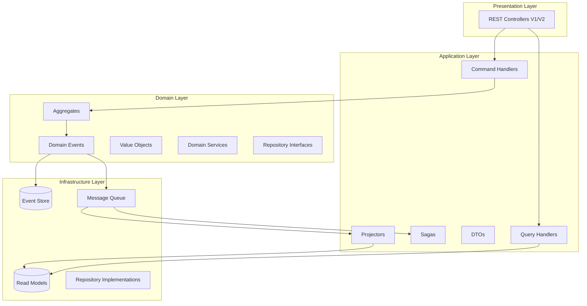
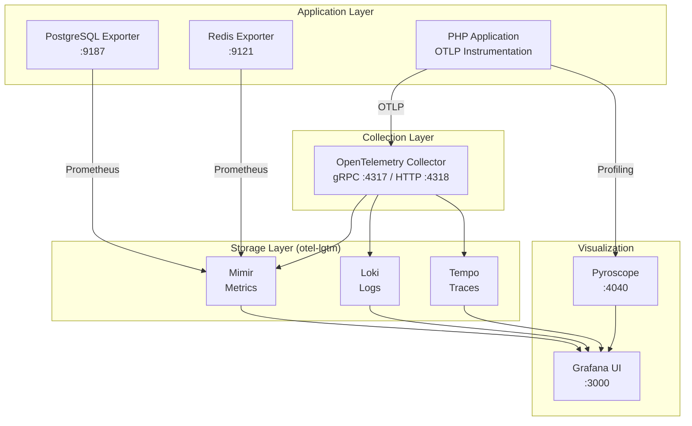

<div align="center">

# Microservices Architecture Article POC

**A production-ready reference implementation of Event Sourcing, CQRS, and DDD patterns**

[](https://php.net/)
[](https://symfony.com/)
[](LICENSE)
[](https://phpstan.org/)
[](https://docker.com/)

<br />

[Quick Start](#getting-started) &middot; [API Reference](#api-reference) &middot; [Architecture](#architecture) &middot; [Development](#development-commands)

</div>

---

<details>
<summary><strong>Table of Contents</strong></summary>

- [About The Project](#about-the-project)
- [Key Features](#key-features)
- [Architecture](#architecture)
  - [System Overview](#system-overview)
  - [Event Sourcing Flow](#event-sourcing-flow)
  - [DDD Layer Structure](#ddd-layer-structure)
- [Tech Stack](#tech-stack)
- [Getting Started](#getting-started)
  - [Prerequisites](#prerequisites)
  - [Installation](#installation)
  - [Configuration](#configuration)
- [API Reference](#api-reference)
  - [Command Endpoints](#command-endpoints)
  - [Query Endpoints](#query-endpoints)
  - [Article Entity Lifecycle](#article-entity-lifecycle)
- [API Documentation (Swagger)](#api-documentation-swagger)
- [Postman Collection](#postman-collection)
  - [Import Instructions](#import-instructions)
  - [Testing Workflow](#testing-workflow)
  - [Environment Variables](#environment-variables)
- [CLI API Testing](#cli-api-testing)
  - [HTTP Request Emulation](#http-request-emulation)
  - [Postman Collection Generator](#postman-collection-generator)
- [Project Structure](#project-structure)
- [Development Commands](#development-commands)
- [FrankenPHP Deployment](#frankenphp-deployment)
- [API Gateway (APISIX)](#api-gateway-apisix)
- [PHPStorm Debugging](#phpstorm-debugging)
  - [CLI Container Setup](#cli-container-setup)
  - [Interpreter Configuration](#interpreter-configuration)
  - [Debug Configuration](#debug-configuration)
  - [Running Tests with Debugging](#running-tests-with-debugging)
  - [Debugging Troubleshooting](#debugging-troubleshooting)
- [Testing](#testing)
- [Code Quality](#code-quality)
- [Project Documentation](#project-documentation)
  - [Architecture Decision Records](#architecture-decision-records)
  - [Security Infrastructure](#security-infrastructure)
  - [Quality Assurance](#quality-assurance)
  - [Static Analysis & Code Style](#static-analysis--code-style)
  - [Performance Testing](#performance-testing)
  - [Infrastructure Modernization](#infrastructure-modernization)
  - [API Gateway Documentation](#api-gateway-documentation)
  - [Observability Stack Documentation](#observability-stack-documentation)
- [Contributing](#contributing)
- [License](#license)

</details>

---

## About The Project

This is a **Article microservice** that serves as a comprehensive reference implementation for building enterprise-grade microservices. It demonstrates how to properly implement **Event Sourcing**, **CQRS (Command Query Responsibility Segregation)**, and **Domain-Driven Design (DDD)** patterns in a real-world application.

Unlike simple tutorials or toy examples, this project showcases production-ready patterns including:
- Complete event sourcing with aggregate snapshots
- Saga-based workflow orchestration
- API versioning (V1, V2) with backward compatibility
- Full observability stack integration
- Circuit breaker and fault tolerance patterns

This architecture enables building scalable, maintainable, and auditable systems where every state change is captured as an immutable event.

<details>
<summary><strong>Architecture Diagram</strong></summary>


</details>

---

## Key Features

| Feature | Description |
|---------|-------------|
| **Event Sourcing** | Complete event store implementation with PostgreSQL, capturing all state changes as immutable domain events |
| **CQRS Pattern** | Separate command and query models with dedicated buses for optimal read/write performance |
| **DDD Layers** | Clean architecture with Domain, Application, Infrastructure, and Presentation layers |
| **Saga Orchestration** | Workflow management via `ArticleCreationPublicationWorkflowSaga` for complex business processes |
| **API Versioning** | Side-by-side V1 and V2 REST APIs with OpenAPI documentation |
| **Aggregate Snapshots** | Performance optimization through aggregate state snapshots |
| **Event Projections** | Real-time read model updates via event projectors |
| **Fault Tolerance** | Circuit breaker patterns and resilient message handling |

---

## Architecture

### System Overview

The architecture follows a layered approach with clear separation of concerns:

```
                                    +-----------------+
                                    |   API Gateway   |
                                    | (Auth, Routing) |
                                    +--------+--------+
                                             |
                    +------------------------+------------------------+
                    |                                                 |
            +-------v-------+                                 +-------v-------+
            |   Commands    |                                 |    Queries    |
            | (Write Model) |                                 | (Read Model)  |
            +-------+-------+                                 +-------+-------+
                    |                                                 |
            +-------v-------+                                 +-------v-------+
            | Command Bus   |                                 |  Query Bus    |
            |  (Tactician)  |                                 |  (Tactician)  |
            +-------+-------+                                 +-------+-------+
                    |                                                 |
            +-------v-------+                                 +-------v-------+
            |   Handlers    |                                 |   Handlers    |
            +-------+-------+                                 +-------+-------+
                    |                                                 |
            +-------v-------+                                 +-------v-------+
            |  Aggregates   |                                 |  Read Models  |
            |   (Domain)    |                                 |   (Queries)   |
            +-------+-------+                                 +-------+-------+
                    |                                                 ^
            +-------v-------+                                         |
            | Domain Events |                                         |
            +-------+-------+                                         |
                    |                                                 |
            +-------v-------+         +---------------+               |
            |  Event Store  +-------->|   Event Bus   +---------------+
            |  (PostgreSQL) |         |  (RabbitMQ)   |    Projectors
            +---------------+         +---------------+
```

### Event Sourcing Flow

```
Command --> CommandHandler --> ArticleEntity (Aggregate) --> DomainEvent --> EventStore (PostgreSQL)
                                                                 |
                                                                 v
                                                    EventBus (RabbitMQ) --> Projectors (Read Models)
```

### DDD Layer Structure



---

## Tech Stack

| Category | Technology | Version |
|----------|------------|---------|
| **Language** |  | 8.4 |
| **Framework** |  | 7.3 |
| **Event Sourcing** | Broadway (micro-module/broadway) | ^2.6 |
| **Command Bus** | League Tactician | ^1.5 |
| **Saga Pattern** | micro-module/broadway-saga | ^0.6 |
| **Database** |  | 16+ |
| **Message Queue** |  | Latest |
| **Cache** |  | Latest |
| **Container** |  | 20.10+ |
| **API Docs** | NelmioApiDocBundle (OpenAPI) | ^5.0 |

---

## Getting Started

### Prerequisites

| Requirement | Version | Check Command |
|-------------|---------|---------------|
| Docker | 20.10+ | `docker --version` |
| Docker Compose | 2.0+ | `docker compose version` |
| Make | 4.0+ | `make --version` |
| Git | 2.30+ | `git --version` |

<details>
<summary><strong>System Requirements</strong></summary>

- **RAM**: Minimum 4GB (8GB recommended)
- **Disk**: 2GB free space
- **OS**: Linux, macOS, or Windows with WSL2

</details>

### Installation

1. **Clone the repository**

   ```bash
   git clone <repository-url>
   cd microservices-architecture-example
   ```

2. **Run the full installation**

   ```bash
   make install
   ```

   This command will:
   - Build Docker images
   - Install PHP dependencies via Composer
   - Set up the PostgreSQL database
   - Run migrations
   - Configure RabbitMQ message queues

3. **Verify the installation**

   ```bash
   docker compose ps
   ```

   All services should show status "Up".

### Configuration

Key configuration is managed through environment variables. Copy `.env.example` to `.env` and adjust as needed:

| Variable | Description | Default |
|----------|-------------|---------|
| `APP_ENV` | Environment (dev/prod/test) | `dev` |
| `DATABASE_URL` | PostgreSQL connection string | `postgresql://...` |
| `MESSENGER_TRANSPORT_DSN` | RabbitMQ connection | `amqp://...` |
| `REDIS_URL` | Redis connection | `redis://localhost` |

---

## API Reference

The API provides versioned endpoints (V1 and V2) following REST conventions with OpenAPI documentation.

### Command Endpoints

Operations that modify state (write model):

| Endpoint | Method | Description |
|----------|--------|-------------|
| `/api/v{1,2}/article` | `POST` | Create a new article article |
| `/api/v{1,2}/article/{uuid}` | `PUT` | Update an existing article article |
| `/api/v{1,2}/article/{uuid}/publish` | `PUT` | Publish a draft article article |
| `/api/v{1,2}/article/{uuid}/unpublish` | `PUT` | Unpublish a published article |
| `/api/v{1,2}/article/{uuid}/archive` | `PUT` | Archive a article article |
| `/api/v{1,2}/article/{uuid}` | `DELETE` | Delete a article article |

### Query Endpoints

Operations that read state (read model):

| Endpoint | Method | Description |
|----------|--------|-------------|
| `/api/v{1,2}/article` | `GET` | List article with criteria filtering |
| `/api/v{1,2}/article/{uuid}` | `GET` | Fetch a single article article by UUID |
| `/api/v{1,2}/article/slug/{slug}` | `GET` | Fetch article article by URL slug |
| `/api/v{1,2}/article/event/{event_id}` | `GET` | List article for a specific event |
| `/api/v{1,2}/article/published` | `GET` | List all published article |
| `/api/v{1,2}/article/archived` | `GET` | List all archived article |

### Article Entity Lifecycle

```
+-------+     publish     +-----------+     archive     +----------+
| draft +---------------->| published +---------------->| archived |
+---+---+                 +-----+-----+                 +----------+
    |                           |
    |                           | unpublish
    |                           v
    |                     +-----------+
    +-------------------->| unpublished|
           delete         +-----------+
                                |
                                | delete
                                v
                          +---------+
                          | deleted |
                          +---------+
```

**Available States:**
- `draft` - Initial state, not visible to public
- `published` - Live and visible
- `unpublished` - Temporarily hidden
- `archived` - Permanently hidden but preserved
- `deleted` - Soft deleted

---

## API Documentation (Swagger)

Interactive API documentation is available via **Swagger UI** powered by [NelmioApiDocBundle](https://github.com/nelmio/NelmioApiDocBundle) with OpenAPI 3.0 specification.

### Documentation URLs

| Version | Swagger UI | OpenAPI JSON |
|---------|------------|--------------|
| **V1** | [http://localhost/api/v1/docs](http://localhost/api/v1/docs) | [http://localhost/api/v1/docs.json](http://localhost/api/v1/docs.json) |
| **V2** | [http://localhost/api/v2/docs](http://localhost/api/v2/docs) | [http://localhost/api/v2/docs.json](http://localhost/api/v2/docs.json) |

### Features

- **Interactive Testing** - Execute API requests directly from the browser
- **Schema Validation** - Request/response schemas with examples
- **Authentication** - Configure API keys and tokens in the UI
- **Try It Out** - Test endpoints with custom parameters

### API Specification

```yaml
openapi: 3.0.0
info:
  title: Article API
  version: 2.0.0
  description: Article microservice with Event Sourcing + CQRS

tags:
  - name: article-commands
    description: Write operations (POST, PUT, DELETE)
  - name: article-queries
    description: Read operations (GET)
```

### Accessing Documentation

1. **Start the application**
   ```bash
   make start
   ```

2. **Open Swagger UI**
   - V2 (recommended): [http://localhost/api/v2/docs](http://localhost/api/v2/docs)
   - V1 (legacy): [http://localhost/api/v1/docs](http://localhost/api/v1/docs)

3. **Explore endpoints**
   - Expand endpoint groups (`article-commands`, `article-queries`)
   - Click "Try it out" to test requests
   - View request/response schemas

---

## Postman Collection

A comprehensive Postman collection is provided for API testing and exploration. The collection includes automated tests, environment variables, and workflow testing.

### Files

| File | Description |
|------|-------------|
| [`Article API V2.postman_collection.json`](tests/postman/Article%20API%20V2.postman_collection.json) | Complete API collection with 15+ requests |
| [`Article API V2.postman_environment.json`](tests/postman/Article%20API%20V2.postman_environment.json) | Environment variables for local development |
| [`api-doc.json`](tests/postman/api-doc.json) | OpenAPI specification export |
| [`ARTICLE_API_README.md`](tests/postman/ARTICLE_API_README.md) | Detailed Postman usage guide |

### Import Instructions

1. **Open Postman Desktop** application

2. **Import collection**
   - Click **Import** (`Ctrl+O` / `Cmd+O`)
   - Drag & drop both JSON files, or click "Upload Files"

3. **Select environment**
   - Click environment dropdown (top-right)
   - Select **"Article API V2 - Local"**

4. **Verify base URL**
   - Default: `http://localhost:8080/api/v2`
   - Adjust in environment variables if needed

### Collection Structure

```
Article API V2/
├── Query Operations/           # CQRS Read Side (GET)
│   ├── List All Article
│   ├── Get Article by UUID
│   ├── Get Article by Slug
│   ├── Get Article by Event
│   ├── Get Published Article
│   ├── Get Archived Article
│   └── Search Article with Filters
│
├── Command Operations/         # CQRS Write Side (POST/PUT/DELETE)
│   ├── Create Article            → ArticleWasCreated event
│   ├── Update Article            → ArticleWasUpdated event
│   ├── Publish Article           → ArticleWasPublished event
│   ├── Unpublish Article         → ArticleWasUnpublished event
│   ├── Archive Article           → ArticleWasArchived event
│   └── Delete Article            → ArticleWasDeleted event
│
└── Workflow Tests/            # End-to-End Tests
    └── Full Lifecycle: Create → Publish → Archive → Delete
```

### Testing Workflow

**Recommended execution order:**

```
1. Query Operations/List All Article     ← Start here (populates article_uuid)
2. Command Operations/Create Article     ← Creates draft article
3. Command Operations/Publish Article    ← Changes status to published
4. Query Operations/Get Article by UUID  ← Verify the changes
5. Command Operations/Archive Article    ← Move to archived
6. Command Operations/Delete Article     ← Remove the article
```

**Using Collection Runner:**

```bash
# Run automated tests
1. Click "Runner" (Ctrl+Shift+R)
2. Select "Article API V2" collection
3. Select "Article API V2 - Local" environment
4. Click "Run"
```

### Environment Variables

| Variable | Default | Description |
|----------|---------|-------------|
| `base_url` | `http://localhost:8080/api/v2` | API base URL |
| `event_id` | `1` | Default event ID for testing |
| `article_uuid` | *(auto-set)* | Stored after create/list operations |
| `article_slug` | *(auto-set)* | Stored after create/list operations |
| `article_title` | `Breaking Article...` | Default title for create |
| `search_status` | `published` | Status filter for searches |

### Test Scripts

Each request includes automated tests that:
- Validate HTTP status codes
- Verify response structure
- Extract and store variables (UUID, slug)
- Log debug information to console

**View test results:**
- Click **Test Results** tab after running a request
- Check **Console** (bottom-left) for detailed logs

### Request Examples

<details>
<summary><strong>Create Article (POST)</strong></summary>

```json
POST /api/v2/article/
Content-Type: application/json

{
    "title": "Breaking Article: New Feature Released",
    "shortDescription": "A brief summary of the new feature.",
    "description": "Full article content with all details...",
    "slug": "breaking-article-new-feature",
    "eventId": 1
}
```

**Response:**
```json
{
    "uuid": "550e8400-e29b-41d4-a716-446655440000"
}
```

</details>

<details>
<summary><strong>Search with Filters (GET)</strong></summary>

```bash
# By status
GET /api/v2/article/?status=published

# By event
GET /api/v2/article/?eventId=1

# Combined filters
GET /api/v2/article/?status=published&eventId=1
```

</details>

### Troubleshooting

| Error | Cause | Solution |
|-------|-------|----------|
| `404 Not Found` | Invalid UUID | Run "Create Article" or "List All Article" first |
| `400 Bad Request` | Invalid JSON | Check request body syntax |
| `422 Unprocessable` | Validation error | Check `violations` field in response |
| `Connection Refused` | Server not running | Run `make start` |

---

## CLI API Testing

The project includes powerful CLI commands for testing APIs without requiring external tools or a running web server. These commands execute requests directly through the Symfony Kernel, making them ideal for CI/CD pipelines, automated testing, and rapid development.

### HTTP Request Emulation

The `app:emulate-request` command allows you to test API endpoints directly from the command line.

#### Single Request Mode

Execute individual HTTP requests with full control over method, headers, and body:

```bash
# Basic syntax
make console cmd="app:emulate-request <method> <path> [headers_json] [body_json]"

# Create a article article
make console cmd='app:emulate-request POST /api/v2/article/ '\''{"Content-Type":"application/json"}'\'' '\''{"title":"Breaking Article","shortDescription":"Summary","description":"Full content","slug":"breaking-article","eventId":1}'\'

# Get all article
make console cmd="app:emulate-request GET /api/v2/article/"

# Get article by UUID
make console cmd="app:emulate-request GET /api/v2/article/550e8400-e29b-41d4-a716-446655440000"

# Publish a article article
make console cmd="app:emulate-request PUT /api/v2/article/550e8400-e29b-41d4-a716-446655440000/publish"

# Delete a article article
make console cmd="app:emulate-request DELETE /api/v2/article/550e8400-e29b-41d4-a716-446655440000"
```

**Options:**

| Option | Description |
|--------|-------------|
| `--verbose` | Show detailed request/response information |
| `--format=json` | Output response in JSON format |

#### Postman Collection Mode

Execute entire Postman collections or specific requests/folders:

```bash
# Run entire collection with environment
make console cmd="app:emulate-request --collection=/app/tests/postman/Article\ API\ V2.postman_collection.json --postman-env=/app/tests/postman/Article\ API\ V2.postman_environment.json"

# Run specific folder only
make console cmd="app:emulate-request --collection=/app/tests/postman/Article\ API\ V2.postman_collection.json --postman-env=/app/tests/postman/Article\ API\ V2.postman_environment.json --folder='Command Operations'"

# Run specific request
make console cmd="app:emulate-request --collection=/app/tests/postman/Article\ API\ V2.postman_collection.json --postman-env=/app/tests/postman/Article\ API\ V2.postman_environment.json --request='Create Article'"

# Skip specific folders
make console cmd="app:emulate-request --collection=/app/tests/postman/Article\ API\ V2.postman_collection.json --postman-env=/app/tests/postman/Article\ API\ V2.postman_environment.json --skip-folders='Workflow Tests'"
```

**Collection Mode Options:**

| Option | Description |
|--------|-------------|
| `--collection=<path>` | Path to Postman collection JSON file |
| `--postman-env=<path>` | Path to Postman environment JSON file |
| `--folder=<name>` | Execute only requests in this folder |
| `--request=<name>` | Execute only this specific request |
| `--skip-folders=<names>` | Comma-separated folders to skip |
| `--skip-requests=<names>` | Comma-separated requests to skip |

**Key Features:**

- **Variable Substitution** - Supports `{{variable}}` syntax from Postman environments
- **No Web Server Required** - Executes through Symfony Kernel directly
- **Full HTTP Simulation** - Headers, cookies, and body are properly processed
- **Response Extraction** - Automatically extracts variables from responses
- **CI/CD Ready** - Exit codes indicate success (0) or failure (non-zero)

### Postman Collection Generator

Generate Postman collections directly from your OpenAPI documentation:

```bash
# Generate collection for API V2 (default)
make console cmd="app:generate-postman-collection"

# Generate collection for specific API version
make console cmd="app:generate-postman-collection --api-version=v1"
make console cmd="app:generate-postman-collection --api-version=v2"

# Generate with custom output path
make console cmd="app:generate-postman-collection --output=/app/tests/postman/generated-collection.json"

# Generate with environment file
make console cmd="app:generate-postman-collection --generate-env --env-name=local-dev"

# Specify base URL in generated environment
make console cmd="app:generate-postman-collection --generate-env --base-url=http://api.example.com"
```

**Generator Options:**

| Option | Description | Default |
|--------|-------------|---------|
| `--api-version=<v>` | API version to document | `v2` |
| `--output=<path>` | Output path for collection | `tests/postman/` |
| `--generate-env` | Also generate environment file | `false` |
| `--env-name=<name>` | Environment name | `Local` |
| `--base-url=<url>` | Base URL for requests | `http://localhost` |

**Generated Collection Features:**

- **CQRS Organization** - Commands and queries separated into folders
- **Entity Grouping** - Requests grouped by domain entity
- **Pre-configured Headers** - Content-Type and Accept headers included
- **Request Examples** - Sample request bodies based on schemas
- **Variable Placeholders** - Uses `{{base_url}}` and entity-specific variables

### CLI Testing Workflow

**Recommended workflow for CI/CD:**

```bash
# 1. Generate fresh collection from OpenAPI
make console cmd="app:generate-postman-collection --generate-env"

# 2. Run full collection test
make console cmd="app:emulate-request --collection=/app/tests/postman/Article\ API\ V2.postman_collection.json --postman-env=/app/tests/postman/Article\ API\ V2.postman_environment.json"

# 3. Check exit code
echo $?  # 0 = success, non-zero = failure
```

**Quick smoke test:**

```bash
# Verify API is responding
make console cmd="app:emulate-request GET /api/v2/article/"
```

---

## Project Structure

```
.
├── bootstrap/              # Application bootstrap files
├── config/
│   ├── domains/
│   │   └── article/          # Article domain configuration
│   │       ├── services/
│   │       │   ├── layer_application.yaml   # Command handlers, sagas
│   │       │   ├── layer_infrastructure.yaml # Repositories
│   │       │   ├── tactician.yaml           # Command bus setup
│   │       │   └── event_queue.yaml         # RabbitMQ queues
│   └── packages/          # Symfony bundle configs
├── docker/                # Docker configurations
├── docs/                  # Documentation
├── src/
│   ├── Common/            # Shared infrastructure
│   ├── Component/         # Reusable components
│   └── Article/              # Article bounded context
│       ├── Application/   # Commands, Queries, Handlers, Sagas, DTOs
│       ├── Domain/        # Aggregates, Events, Value Objects
│       ├── Infrastructure/# Repository implementations, Event store
│       └── Presentation/  # REST Controllers (V1, V2)
├── tests/
│   ├── Api/               # API endpoint tests
│   ├── Feature/           # Feature tests
│   ├── Functional/        # Functional tests
│   ├── Integration/       # Integration tests
│   ├── Unit/              # Unit tests
│   └── postman/           # Postman collections
├── Makefile               # Development commands
└── README.md              # This file
```

---

## Development Commands

### Container Management

```bash
make install              # Full install (build, setup DB, start services)
make start                # Start all containers
make stop                 # Stop containers
make build                # Build Docker images
```

### Dependencies

```bash
make composer-install     # Install PHP dependencies
make composer-update      # Update dependencies
```

### Database

```bash
make setup-db             # Drop, create, and migrate database
make migration-generate   # Generate new migration
make migration-migrate    # Run migrations
make migration-diff       # Generate migration from schema diff
```

### Message Queues

```bash
make setup-enqueue        # Setup RabbitMQ brokers
```

### Console & Shell Access

```bash
make console              # Run Symfony console commands
make php-shell            # PHP shell with autoloader
make database-shell       # PostgreSQL shell
```

---

## FrankenPHP Deployment (Alternative)

This project supports **FrankenPHP** as an alternative to the traditional nginx + PHP-FPM stack. FrankenPHP consolidates the web server and PHP runtime into a single container using worker mode for improved performance.

### When to Use FrankenPHP

| Deployment | Best For | Trade-offs |
|------------|----------|------------|
| **nginx + PHP-FPM** (default) | Development, debugging, fine-grained control | More containers, separate scaling |
| **FrankenPHP** | Production, high performance, simplified ops | Single container, less debugging visibility |

### FrankenPHP Commands

```bash
# Start FrankenPHP stack (replaces nginx + PHP-FPM)
make start-frankenphp

# Stop FrankenPHP stack
make stop-frankenphp

# Restart FrankenPHP stack
make restart-frankenphp

# View logs
make logs-frankenphp          # Main container only
make logs-frankenphp-all      # All containers

# Shell access
make shell-frankenphp

# Container status
make ps-frankenphp

# Stop and remove containers
make down-frankenphp
```

### Building FrankenPHP Image

```bash
# Build FrankenPHP Docker image
make build-frankenphp
```

### Performance Benchmarking

```bash
# Full benchmark comparing FrankenPHP vs nginx+PHP-FPM
make benchmark-frankenphp

# Quick benchmark (1000 requests, 50 concurrent)
make benchmark-frankenphp-quick
```

### Architecture Details

FrankenPHP uses **worker mode** where PHP workers persist between requests, eliminating process spawn overhead:

- **Worker processes**: 4 workers (configurable via `FRANKENPHP_NUM_WORKERS`)
- **JIT compilation**: `opcache.jit=1255` with 128M buffer
- **Graceful shutdown**: SIGQUIT signal handling
- **Health checks**: `/health` endpoint monitoring

For complete architecture decision rationale, see [ADR-005: PHP Runtime Selection](docs/adr/ADR-005-php-runtime-selection.md).

---

## API Gateway (APISIX)

Apache APISIX serves as the API Gateway, providing traffic management, rate limiting, observability, and routing to multiple PHP runtimes.

### Quick Start

```bash
# APISIX with PHP-FPM (default)
make apisix-fpm-up

# APISIX with RoadRunner
make apisix-rr-up

# APISIX with FrankenPHP
make apisix-frank-up

# Check status
make apisix-ps

# View logs
make apisix-logs

# Stop all
make apisix-down
```

### Key Endpoints

| Endpoint | Description |
|----------|-------------|
| `GET /apisix/health` | Gateway health check |
| `GET /health` | Backend application health |
| `GET /api/v1/article` | Article API v1 (100 req/s limit) |
| `GET /api/v2/article` | Article API v2 (200 req/s limit) |
| `/apisix/prometheus/metrics` | Prometheus metrics (port 9091) |

### Ports

| Port | Service |
|------|---------|
| 9080 | HTTP API Gateway |
| 9443 | HTTPS API Gateway |
| 9181 | Admin API |
| 9091 | Prometheus metrics |
| 9000 | Dashboard UI |

### Configuration

APISIX runs in **standalone mode** with YAML configuration:
- Routes: `apisix/apisix.yaml`
- Core config: `apisix/config.yaml`

For complete documentation, see [API Gateway Documentation](docs/api-gateway/README.md).

---

## Observability Stack (OpenTelemetry)

This project uses the **grafana/otel-lgtm** all-in-one container for unified observability, providing metrics, logs, traces, and profiling through OpenTelemetry.

### Quick Start

```bash
# Start observability stack
make otel-start

# View stack status
make otel-status

# Check component health
make otel-health

# View logs
make otel-logs

# Stop stack
make otel-stop

# Full cleanup (including volumes)
make otel-clean
```

### Architecture Overview



### Components & Ports

| Component | Port | Description |
|-----------|------|-------------|
| Grafana UI | 3000 | Dashboards, alerting, visualization |
| OTLP gRPC | 4317 | OpenTelemetry gRPC receiver |
| OTLP HTTP | 4318 | OpenTelemetry HTTP receiver |
| Pyroscope | 4040 | Continuous profiling UI |
| PostgreSQL Exporter | 9187 | PostgreSQL metrics for Prometheus |
| Redis Exporter | 9121 | Redis metrics for Prometheus |

### Dashboards

Pre-provisioned Grafana dashboards for OpenTelemetry observability:

| Dashboard | Purpose |
|-----------|---------|
| **Mimir Metrics** | Application metrics overview, request rates, resource usage |
| **SLO Overview** | Service Level Objectives with error budget tracking |
| **Command Bus Performance** | Tactician command bus latency, throughput, handler metrics |
| **Event Sourcing Flow** | Event store writes, Broadway events, projector processing |
| **Loki Logs** | Centralized logs with trace correlation, error tracking |
| **Tempo Traces** | Distributed tracing visualization, span analysis |
| **Profiling** | CPU/memory flame graphs via Pyroscope continuous profiling |

Access dashboards at: `http://localhost:3000` (default: admin/admin)

### Alerting

The stack includes 12 pre-configured alert rules across infrastructure and application layers:

#### Infrastructure Alerts (7 rules)

| Alert | Severity | Threshold |
|-------|----------|-----------|
| PostgreSQL Connections High | warning | >80% max connections |
| PostgreSQL Slow Queries | warning | Queries >1s execution |
| Redis Memory High | warning | >80% max memory |
| Redis Connections Rejected | critical | Any rejected connections |
| RabbitMQ Queue Depth High | warning | >1000 messages pending |
| RabbitMQ No Consumers | critical | Queue with messages, no consumers |

#### Application Alerts (5 rules)

| Alert | Severity | Threshold |
|-------|----------|-----------|
| High Error Rate (5xx) | critical | >1% error rate |
| High Latency (p95) | warning | p95 >200ms |
| High Latency (p99) | critical | p99 >500ms |
| Event Store Write Failures | critical | Any write failures |
| Event Projection Lag | warning | Lag >30 seconds |

#### Contact Points

Alerts are routed to configured notification channels:
- **ops-webhook**: Webhook integration (PagerDuty, OpsGenie)
- **ops-email**: Email notifications for critical alerts
- **platform-team**: Infrastructure team notifications
- **application-team**: Application team notifications
- **dev-console**: Development logging (testing)

### Continuous Profiling (Pyroscope)

Pyroscope provides always-on profiling for performance analysis without sampling overhead:

```bash
# Access Pyroscope UI
open http://localhost:4040

# View in Grafana (integrated datasource)
open http://localhost:3000/explore?orgId=1&left=%5B%22now-1h%22,%22now%22,%22Pyroscope%22%5D
```

**Profiling Types:**
- CPU profiling - Identify hot code paths
- Memory profiling - Track allocations and leaks
- Wall-clock profiling - Find blocking operations

### Configuration

| File | Purpose |
|------|---------|
| `docker-compose.observability-dev.yml` | Stack container definitions |
| `.docker/grafana/provisioning/datasources/` | Datasource configurations |
| `.docker/grafana/provisioning/dashboards/` | Dashboard JSON definitions |
| `.docker/grafana/provisioning/alerting/` | Alert rules and contact points |

For architecture decisions and rationale, see [ADR-014: Observability Stack Modernization](docs/adr/ADR-014-observability-stack-modernization.md).

### Troubleshooting

```bash
# Check if stack is healthy
make otel-health

# View detailed logs
make otel-logs

# Restart stack
make otel-restart

# Full reset (removes all data)
make otel-clean && make otel-start
```

**Common Issues:**
- **Grafana not loading**: Wait 60s for startup, check `make otel-health`
- **No metrics appearing**: Verify exporters are running with `docker compose -f docker-compose.observability-dev.yml ps`
- **Alerts not firing**: Check datasource connectivity in Grafana > Alerting > Alert rules

---

## PHPStorm Debugging

This project includes a dedicated PHP CLI container optimized for PHPStorm integration. The container runs with Xdebug in auto-start mode, enabling debugging without browser extensions.

### CLI Container Setup

Start the CLI development container:

```bash
# Start CLI container (persistent, for PHPStorm)
make start-cli

# Check container status and Xdebug config
make cli-status

# Stop when done
make stop-cli
```

The CLI container is configured with:
- **Xdebug auto-start**: Debugging starts automatically for all CLI scripts
- **IDE key**: `PHPSTORM`
- **Port**: 9003 (Xdebug 3.x default)
- **Persistent container**: Uses `tail -f /dev/null` to stay running

### Interpreter Configuration

#### Option 1: Docker Compose (Recommended)

1. **Settings** → **PHP** → **CLI Interpreter** → **Add** → **From Docker, Vagrant, VM, WSL, Remote...**
2. Select **Docker Compose**
3. Configuration files:
   - `docker-compose.yml`
4. Service: `test-micro-article-system-cli`
5. PHP executable: `php`
6. Apply and verify PHP version shows `8.4.x`

#### Option 2: Existing Container (Alternative)

If Docker Compose parsing fails:

1. **Settings** → **PHP** → **CLI Interpreter** → **Add** → **From Docker, Vagrant, VM, WSL, Remote...**
2. Select **Docker**
3. Server: `Docker` (local)
4. Image: Leave empty, use existing container
5. Container: `test-micro-article-system-cli`
6. Lifecycle: **Connect to existing container**
7. Path mappings: `/app` → `<project-root>`

### Debug Configuration

#### PHP Remote Debug Configuration

1. **Run** → **Edit Configurations** → **Add** → **PHP Remote Debug**
2. Name: `CLI Debug`
3. Filter debug connection by IDE key: ☑ Enabled
4. IDE key: `PHPSTORM`
5. Server: Create new server:
   - Name: `localhost`
   - Host: `localhost`
   - Port: `80`
   - Debugger: `Xdebug`
   - Path mappings: `<project-root>` → `/app`

#### Xdebug Settings in PHPStorm

1. **Settings** → **PHP** → **Debug**
2. Xdebug section:
   - Debug port: `9003`
   - ☑ Can accept external connections
   - ☑ Resolve breakpoint if it's not available on the current line

### Running Tests with Debugging

Set breakpoints in your code, then:

```bash
# Run PHPUnit with debugging (auto-starts Xdebug)
make cli-test tests/Unit/Article/Domain/ValueObject/TitleTest.php

# Run specific test method
make cli-test --filter testConstructWithValidValue tests/Unit/Article/Domain/ValueObject/TitleTest.php

# Run Symfony console with debugging
make cli-console app:some-command

# Run any PHP script with debugging
make cli-php script="scripts/test.php"

# Execute arbitrary command
make cli-exec cmd="php bin/console cache:clear"
```

**Before running**: Click the "Start Listening for PHP Debug Connections" button (phone icon) in PHPStorm's toolbar.

### Debugging Troubleshooting

#### Breakpoints Not Hit

1. **Verify Xdebug is active**:
   ```bash
   make cli-status
   # Should show: xdebug.mode = debug
   #              xdebug.start_with_request = yes
   ```

2. **Check path mappings**: Ensure `<project-root>` maps to `/app`

3. **Verify IDE key**: Must be exactly `PHPSTORM`

4. **Check port**: Xdebug 3.x uses port `9003` (not 9000)

#### Connection Refused

1. **Firewall**: Allow incoming connections on port 9003

2. **Docker host**: For WSL2/Docker Desktop, `host.docker.internal` should resolve correctly

3. **Verify listener**: PHPStorm's debug listener must be active (phone icon green)

#### Container Won't Start

```bash
# Check network exists
docker network ls | grep test_article_net

# If missing, start base infrastructure first
make start

# Then start CLI container
make start-cli
```

#### Wrong PHP Extensions

```bash
# Verify extensions in container
docker compose exec test-micro-article-system-cli php -m | grep -E "xdebug|pdo_pgsql|intl"
```

### Environment Variables

The CLI container uses these Xdebug-related variables:

| Variable | Default | Description |
|----------|---------|-------------|
| `XDEBUG_CLI_MODE` | `debug` | Xdebug mode for CLI (debug, coverage, off) |
| `PHP_IDE_CONFIG` | `serverName=localhost` | PHPStorm server name |
| `XDEBUG_SESSION` | `PHPSTORM` | IDE key for debug sessions |

Override in `.env` to change behavior:

```bash
# Disable CLI debugging
XDEBUG_CLI_MODE=off

# Enable code coverage mode
XDEBUG_CLI_MODE=coverage
```

---

## Testing

```bash
# Run all tests with code style checks
make composer-test

# Run PHPUnit directly
./vendor/bin/phpunit

# Run specific test suite
./vendor/bin/phpunit tests/Unit/
./vendor/bin/phpunit tests/Integration/
./vendor/bin/phpunit tests/Functional/
./vendor/bin/phpunit tests/Api/

# Run single test file
./vendor/bin/phpunit tests/Unit/Article/Path/To/TestFile.php
```

### Test Structure

| Directory | Purpose |
|-----------|---------|
| `tests/Unit/` | Fast, isolated unit tests |
| `tests/Integration/` | Database and service integration tests |
| `tests/Functional/` | Full feature tests |
| `tests/Api/` | API endpoint tests |
| `tests/postman/` | Postman collections for manual testing |

### Test Generation with Status Tracking

This project uses an automated test generation pipeline with real-time status tracking. The system generates comprehensive unit tests following DDD/CQRS patterns with:

- **Mock Factory Traits** - Reusable mock helpers (no inline `Mockery::mock()`)
- **DataProvider Classes** - External data providers using PHPUnit 10 attributes
- **14-State Lifecycle** - Track progress from `pending` → `done`/`failed`
- **Quality Assurance** - Automatic review scoring (threshold: 70/100)
- **Coverage Tracking** - Central coverage map in `tests/Unit/coverage-map.json`

#### Quick Start

```bash
# Generate tests for a single class
/test:cover-with-tests src/Article/Domain/ValueObject/Title.php

# Generate tests for a service with dependencies
/test:cover-with-tests src/Article/Domain/Service/ArticleSlugGeneratorService.php

# Check coverage status
cat tests/Unit/coverage-map.json | jq '.classes[] | select(.status == "done")'
```

#### Pipeline Stages

| Stage | Status | Artifacts Created |
|-------|--------|-------------------|
| **Discover** | `discovered` | Class metadata |
| **Analyze** | `analyzed` | Scenario list (JSON) |
| **Generate Mocks** | `mocks_generated` | `tests/Unit/Mock/**/*MockHelper.php` |
| **Generate DataProvider** | `dataprovider_generated` | `tests/Unit/DataProvider/**/*DataProvider.php` |
| **Write Tests** | `tests_written` | `tests/Unit/**/*Test.php` |
| **Review** | `done` or `failed` | Quality score (0-100) |

#### Test Architecture Standards

**1. DataProvider Classes (PHPUnit 10)**

```php
namespace Tests\Unit\DataProvider\Article\Domain\Service;

final class ArticleSlugGeneratorServiceDataProvider
{
    public static function getDataForGenerateSlugSuccessMethod(): array
    {
        return [
            'scenario_name' => [
                // mockArgs - test input and expected values
                [
                    'title' => 'My Article',
                    'expected' => 'my-article',
                    'slugify' => ['slugify' => 'my-article'],
                    'uniquenessChecker' => ['slugExists' => false],
                ],
                // mockTimes - method call expectations
                [
                    'slugify' => ['slugify' => 1],
                    'uniquenessChecker' => ['slugExists' => 1],
                ],
            ],
        ];
    }
}
```

**2. Mock Factory Traits**

```php
namespace Tests\Unit\Mock\Vendor;

trait SlugifyInterfaceMockHelper
{
    protected function createSlugifyInterfaceMock(
        array $mockArgs = [],
        array $mockTimes = []
    ): MockInterface {
        $mock = Mockery::mock(SlugifyInterface::class);

        if (isset($mockArgs['slugify'])) {
            $mock->shouldReceive('slugify')
                ->times($mockTimes['slugify'] ?? 1)
                ->andReturn($mockArgs['slugify']);
        }

        return $mock;
    }
}
```

**3. Test Classes**

```php
#[CoversClass(ArticleSlugGeneratorService::class)]
class ArticleSlugGeneratorServiceTest extends TestCase
{
    use MockeryPHPUnitIntegration;
    use SlugifyInterfaceMockHelper;
    use SlugUniquenessCheckerInterfaceMockHelper;

    #[Test]
    #[DataProviderExternal(ArticleSlugGeneratorServiceDataProvider::class, 'getDataForGenerateSlugSuccessMethod')]
    public function generateSlugWithValidInputShouldReturnSlug(
        array $mockArgs,
        array $mockTimes = []
    ): void {
        // Arrange - create mocks using trait methods
        $slugifyMock = $this->createSlugifyInterfaceMock(
            $mockArgs['slugify'] ?? [],
            $mockTimes['slugify'] ?? []
        );

        // Act
        $service = new ArticleSlugGeneratorService($slugifyMock, ...);
        $result = $service->generateSlug($mockArgs['title']);

        // Assert
        self::assertSame($mockArgs['expected'], $result);
    }
}
```

#### Coverage Map Format

The `tests/Unit/coverage-map.json` file tracks test generation status:

```json
{
  "classes": [
    {
      "class_path": "src/Article/Domain/ValueObject/Title.php",
      "class_name": "Title",
      "namespace": "Micro\\Article\\Domain\\ValueObject",
      "status": "done",
      "test_file": "tests/Unit/Article/Domain/ValueObject/TitleTest.php",
      "scenarios": {
        "total": 20,
        "covered": 20,
        "pending": []
      },
      "artifacts": {
        "mock_traits": ["tests/Unit/Mock/Vendor/ValueObjectInterfaceMockHelper.php"],
        "dataprovider_file": "tests/Unit/DataProvider/Article/Domain/ValueObject/TitleDataProvider.php"
      },
      "review_score": 98,
      "coverage_percentage": 1.0,
      "last_updated": "2025-12-22T..."
    }
  ],
  "statistics": {
    "total_classes": 68,
    "done": 2,
    "pending": 66,
    "failed": 0
  }
}
```

**Status Values:**
- `pending` - Not started
- `discovered` - Class metadata extracted
- `analyzed` - Scenarios identified
- `mocks_generated` - Mock traits created
- `dataprovider_generated` - DataProvider class created
- `tests_written` - Test file created
- `done` - All steps completed, review passed
- `failed` - Pipeline failed at some stage

#### Troubleshooting

**Issue: `ArgumentCountError: Too few arguments to function`**

**Cause:** Using old `#[DataProvider(...)]` instead of `#[DataProviderExternal]`

**Fix:**
```php
// ❌ Wrong (PHPUnit 9 style)
#[DataProvider('Tests\Unit\DataProvider\...\TitleDataProvider::getDataForToStringMethod')]

// ✅ Correct (PHPUnit 10 style)
#[DataProviderExternal(TitleDataProvider::class, 'getDataForToStringMethod')]
```

**Issue: `Class "...\DataProvider" does not exist`**

**Cause:** DataProvider class not in correct namespace or not imported

**Fix:**
```php
// Add import at top of test file
use Tests\Unit\DataProvider\Article\Domain\ValueObject\TitleDataProvider;

// Use class constant in attribute
#[DataProviderExternal(TitleDataProvider::class, 'getDataForToStringMethod')]
```

**Issue: Tests fail with "Call to undefined method"**

**Cause:** Mock trait method name mismatch or missing mock configuration

**Fix:**
- Verify mock trait method: `create{InterfaceName}Mock()`
- Check mockArgs/mockTimes contain all required method calls
- Ensure trait is imported: `use SlugifyInterfaceMockHelper;`

**Issue: Review score below 70**

**Cause:** Missing test scenarios, poor coverage, or structural issues

**Fix:**
1. Check `coverage-map.json` for `scenarios.pending`
2. Review missing scenarios listed in review report
3. Add DataProvider entries for uncovered scenarios
4. Re-run test generation or manually add missing tests

#### Quality Metrics

**Production Standards:**
- ✅ Review score ≥ 70/100
- ✅ No inline `Mockery::mock()` calls
- ✅ All tests use `#[DataProviderExternal]`
- ✅ Mock traits follow `create{Interface}Mock()` pattern
- ✅ DataProvider uses `mockArgs/mockTimes` tuple format
- ✅ 85%+ branch coverage target

**Current Status:**
- 2 classes tested (Title, ArticleSlugGeneratorService)
- 44 tests generated (30 + 14)
- 94 assertions (49 + 45)
- 100% test pass rate
- Average review score: 85.5/100

For detailed documentation, see:
- Implementation Report: `docs/updates/STATUS-TRACKING-IMPLEMENTATION-COMPLETE.md`
- Quick Summary: `docs/updates/STATUS-TRACKING-QUICK-SUMMARY.md`

---

## Code Quality

This project maintains high code quality standards with multiple static analysis tools:

| Tool | Purpose | Configuration |
|------|---------|---------------|
| **PHPStan** | Static analysis (Level 6) | `phpstan.dist.neon` |
| **ECS** | Code style (PSR-12+) | `ecs.php` |
| **Rector** | Code modernization | `rector.php` |
| **Deptrac** | Layer dependency rules | `depfile.yaml` |
| **Infection** | Mutation testing (MSI 74%) | `infection.json5` |

### Running Quality Checks

```bash
# Fix code style issues
make composer-fix-style

# Validate service container
make lint-container

# Run PHPStan analysis
./vendor/bin/phpstan analyse

# Run ECS check
./vendor/bin/ecs check src/
```

### Mutation Testing

Mutation testing measures test quality by verifying tests detect code changes:

```bash
# Full mutation testing (generates coverage + runs Infection)
make infection-full

# Or step-by-step:
make infection-coverage   # Step 1: Generate Unit test coverage
make infection            # Step 2: Run mutation testing
```

**Current Baseline**: MSI 74.04% (405/547 mutants killed) | Threshold: 70%

See [Mutation Testing Guide](docs/testing/MUTATION_TESTING.md) and [ADR-011](docs/adr/ADR-011-mutation-testing-strategy.md) for details.

---

## Project Documentation

This project includes comprehensive documentation covering architecture decisions, security, quality assurance, and infrastructure modernization.

### Architecture Decision Records

All major architectural decisions are documented as ADRs in `docs/adr/`:

| ADR | Title | Status |
|-----|-------|--------|
| [ADR-001](docs/adr/ADR-001-event-sourcing-cqrs-architecture.md) | Event Sourcing & CQRS Architecture | Accepted |
| [ADR-002](docs/adr/ADR-002-technology-stack-selection.md) | Technology Stack Selection | Accepted |
| [ADR-003](docs/adr/ADR-003-message-broker-selection.md) | Message Broker Selection (RabbitMQ) | Accepted |
| [ADR-004](docs/adr/ADR-004-event-sourcing-for-article-aggregate.md) | Event Sourcing for Article Aggregate | Accepted |
| [ADR-005](docs/adr/ADR-005-php-runtime-selection.md) | PHP Runtime Selection | Accepted |
| [ADR-006](docs/adr/ADR-006-api-versioning-strategy.md) | API Versioning Strategy | Accepted |
| [ADR-007](docs/adr/ADR-007-testing-strategy.md) | Testing Strategy | Accepted |
| [ADR-008](docs/adr/ADR-008-static-analysis-tools.md) | Static Analysis Tools | Accepted |
| [ADR-009](docs/adr/ADR-009-read-model-architecture.md) | Read Model Architecture | Accepted |
| [ADR-010](docs/adr/ADR-010-hmac-sha256-signed-message-validation.md) | HMAC-SHA256 Message Signing | Accepted |
| [ADR-011](docs/adr/ADR-011-mutation-testing-strategy.md) | Mutation Testing Strategy | Accepted |
| [ADR-012](docs/adr/ADR-012-performance-testing-strategy.md) | Performance Testing Strategy | Accepted |
| [ADR-013](docs/adr/ADR-013-api-gateway-selection.md) | API Gateway Selection (APISIX) | Accepted |
| [ADR-014](docs/adr/ADR-014-observability-stack-modernization.md) | Observability Stack Modernization | Accepted |
| [ADR-015](docs/adr/ADR-015-jwt-user-microservice-integration.md) | JWT User Microservice Integration | Accepted |

**Full ADR Index**: [docs/adr/index.md](docs/adr/index.md)

### Security Infrastructure

Security is implemented across multiple layers with comprehensive authentication and message validation:

| Component | Documentation | ADR |
|-----------|---------------|-----|
| **HMAC-SHA256 Message Signing** | Cryptographic validation for inter-service messages | [ADR-010](docs/adr/ADR-010-hmac-sha256-signed-message-validation.md) |
| **JWT Integration** | Token-based authentication with User microservice | [ADR-015](docs/adr/ADR-015-jwt-user-microservice-integration.md) |
| **Stateless CSRF Protection** | Double-submit cookie pattern implementation | [TASK-010](docs/tasks/phase-4-security-infrastructure/TASK-010-stateless-csrf.md) |
| **Docker Security Optimization** | Container hardening and security best practices | [TASK-011](docs/tasks/phase-4-security-infrastructure/TASK-011-docker-optimization.md) |

**Security Implementation Tasks**: `docs/tasks/phase-4-security-infrastructure/`

### Quality Assurance

Quality assurance encompasses testing strategies, mutation testing, and continuous improvement:

| Component | Documentation | Description |
|-----------|---------------|-------------|
| **Mutation Testing** | [Guide](docs/testing/MUTATION_TESTING.md) | Infection framework integration (MSI 74%) |
| **Mutation Testing ADR** | [ADR-011](docs/adr/ADR-011-mutation-testing-strategy.md) | Strategy and thresholds |
| **PHPUnit Upgrade** | [TASK-022](docs/tasks/phase-6-quality-assurance/TASK-022-phpunit-upgrade.md) | PHPUnit 11 migration |
| **Testing Strategy** | [ADR-007](docs/adr/ADR-007-testing-strategy.md) | Unit, Integration, Functional testing |

**QA Tasks**: `docs/tasks/phase-6-quality-assurance/`

### Static Analysis & Code Style

Multiple static analysis tools ensure code quality and consistency:

| Tool | Purpose | Configuration | Documentation |
|------|---------|---------------|---------------|
| **PHPStan** | Static analysis (Level 6) | `phpstan.dist.neon` | [ADR-008](docs/adr/ADR-008-static-analysis-tools.md) |
| **ECS** | Code style (PSR-12+) | `ecs.php` | [ADR-008](docs/adr/ADR-008-static-analysis-tools.md) |
| **Rector** | Code modernization | `rector.php` | [ADR-008](docs/adr/ADR-008-static-analysis-tools.md) |
| **Deptrac** | Layer dependency rules | `depfile.yaml` | [ADR-008](docs/adr/ADR-008-static-analysis-tools.md) |

```bash
# Run all static analysis
./vendor/bin/phpstan analyse
./vendor/bin/ecs check src/
./vendor/bin/rector process --dry-run
./vendor/bin/deptrac analyse
```

### Performance Testing

Performance testing uses k6 for load testing with comprehensive metrics:

| Component | Documentation | Description |
|-----------|---------------|-------------|
| **Performance Testing Guide** | [Guide](docs/testing/PERFORMANCE-TESTING.md) | k6 load testing setup |
| **Performance Strategy** | [ADR-012](docs/adr/ADR-012-performance-testing-strategy.md) | Benchmarks and thresholds |
| **Performance Validation** | [TASK-033](docs/tasks/phase-9-infrastructure-modernization/TASK-033-performance-validation.md) | Validation procedures |

**Targets**: p95 latency < 200ms, throughput > 100 RPS, error rate < 1%

```bash
# Run performance tests
k6 run tests/performance/load-test.js
```

### Infrastructure Modernization

Docker infrastructure has been modernized with optimized configurations:

| Task | Documentation | Description |
|------|---------------|-------------|
| **Overview** | [README](docs/tasks/phase-9-infrastructure-modernization/README.md) | Phase 9 overview |
| **Base Infrastructure** | [TASK-028](docs/tasks/phase-9-infrastructure-modernization/TASK-028-base-infrastructure-extraction.md) | Core infrastructure extraction |
| **Runtime Overlays** | [TASK-029](docs/tasks/phase-9-infrastructure-modernization/TASK-029-runtime-overlay-files.md) | PHP-FPM, RoadRunner, FrankenPHP overlays |
| **Workers Extraction** | [TASK-030](docs/tasks/phase-9-infrastructure-modernization/TASK-030-shared-workers-extraction.md) | Background workers setup |
| **Port Standardization** | [TASK-031](docs/tasks/phase-9-infrastructure-modernization/TASK-031-port-standardization.md) | Service port conventions |
| **Cleanup** | [TASK-032](docs/tasks/phase-9-infrastructure-modernization/TASK-032-cleanup-redundant-files.md) | Legacy file removal |

**Phase Tasks**: `docs/tasks/phase-9-infrastructure-modernization/`

### API Gateway Documentation

Apache APISIX serves as the API Gateway with comprehensive configuration:

| Component | Documentation | Description |
|-----------|---------------|-------------|
| **Gateway Selection** | [ADR-013](docs/adr/ADR-013-api-gateway-selection.md) | APISIX vs alternatives comparison |
| **Configuration** | `apisix/config.yaml` | Routes, plugins, upstreams |
| **OpenTelemetry Plugin** | [ADR-014](docs/adr/ADR-014-observability-stack-modernization.md) | Distributed tracing integration |

**Gateway Features**:
- Rate limiting and traffic control
- JWT authentication
- OpenTelemetry distributed tracing
- Health checks and circuit breaker

### Observability Stack Documentation

Modern observability with OpenTelemetry and Grafana LGTM stack:

| Component | Documentation | Description |
|-----------|---------------|-------------|
| **Observability ADR** | [ADR-014](docs/adr/ADR-014-observability-stack-modernization.md) | Stack modernization decision |
| **Implementation Checklist** | [Checklist](docs/adr/ADR-014-implementation-checklist.md) | Phase-by-phase implementation |
| **Phase 5 Cleanup** | [PHASE-5](docs/tasks/PHASE-5-OBSERVABILITY-CLEANUP.md) | Final cleanup and validation |
| **Remaining Tasks** | [TODO](docs/tasks/TODO-OBSERVABILITY.md) | Outstanding work items |
| **Operations Guide** | `docs/operations/observability/` | Runbooks and troubleshooting |

**Four Pillars of Observability**:

| Pillar | Backend | Access |
|--------|---------|--------|
| **Logs** | Loki | Grafana :3000 |
| **Traces** | Tempo | Grafana :3000 |
| **Metrics** | Mimir | Grafana :3000 |
| **Profiling** | Pyroscope | :4040 |

```bash
# Start observability stack
make otel-start

# Check status
docker compose -f docker-compose.observability-dev.yml ps

# Access Grafana
open http://localhost:3000
```

---

## Contributing

1. Fork the repository
2. Create your feature branch (`git checkout -b feature/amazing-feature`)
3. Ensure tests pass (`make composer-test`)
4. Fix code style (`make composer-fix-style`)
5. Commit your changes (`git commit -m 'Add amazing feature'`)
6. Push to the branch (`git push origin feature/amazing-feature`)
7. Open a Pull Request

### Development Workflow

```bash
# Install dependencies
make composer-install

# Run tests before committing
make composer-test

# Fix code style
make composer-fix-style

# Validate container
make lint-container
```

---

## License

This project is **proprietary software**. All rights reserved.

---

<div align="center">

**Built with modern PHP best practices**


</div>
